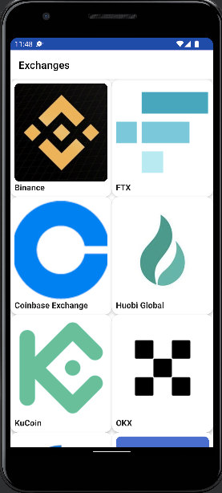

# CoinGecko
Mobile app to show Exchanges used in Cryptocurrency.Written using Jetpack Compose, kotlinDsl and CleanArchitecture

NB:

🚧 

The app shows the list of exchanges in GridView,on navigation the app displays a blank page for now.WIP
to make the exchanges details page to display more info)

while using the coins endpoint,navigation takes place though.

## Art

||
|:----:|

## Tech-stack

* Tech-stack
    * [Kotlin](https://kotlinlang.org/) - a cross-platform, statically typed, general-purpose programming language with type inference.
    * [Coroutines](https://kotlinlang.org/docs/reference/coroutines-overview.html) - perform background operations.
    * [Jetpack Compose](https://developer.android.com/jetpack/compose)- create UIs
    * [Flow](https://kotlinlang.org/docs/reference/coroutines/flow.html) - handle the stream of data asynchronously that executes sequentially.
    * [Hilt](https://developer.android.com/training/dependency-injection/hilt-android) - dependency injection framework.
    * [Jetpack](https://developer.android.com/jetpack)
        * [LiveData](https://developer.android.com/topic/libraries/architecture/livedata) - is an observable data holder.
        * [Lifecycle](https://developer.android.com/topic/libraries/architecture/lifecycle) - perform action when lifecycle state changes.
        * [ViewModel](https://developer.android.com/topic/libraries/architecture/viewmodel) - store and manage UI-related data in a lifecycle conscious way.
* Architecture
    * MVVM - Model View View Model
* Gradle
    * [Gradle Kotlin DSL](https://docs.gradle.org/current/userguide/kotlin_dsl.html) - For reference purposes, here's an [article explaining the migration](https://medium.com/@evanschepsiror/migrating-to-kotlin-dsl-4ee0d6d5c977).

* CI/CD
    * Github Actions
  
## Dependencies

All the dependencies (external libraries) are defined in the single place - Gradle `buildSrc` folder. This approach allows to easily manage dependencies and use the same dependency version across all modules.

## TODO

- Navigate from exchanges screen to exchanges detail page.
- Use the search endpoint.
- Create bottom nav for the coins endpoint.

